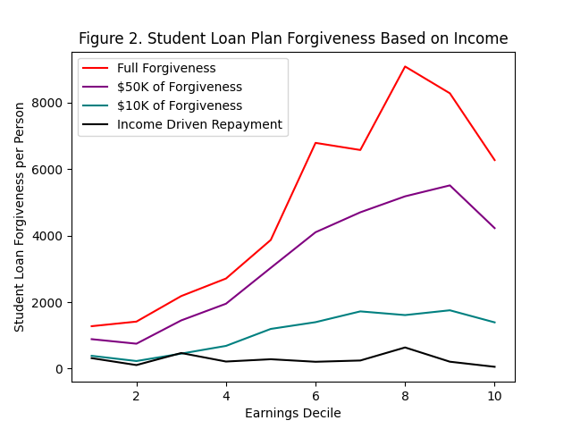

# HW 2: Visualizing interesting datasets
Check out the project instructions [here](https://github.com/mikeizbicki/cmc-csci040/tree/2021fall/hw_02)!
## Mean Earnings per Hour for Males and Females

My first graph shows the difference between mean hourly wages for males and females. Mean hourly wages is shown on the y-axis and whether an individual is a male or female is shown on the x-axis. The graph shows that men have a higher mean hourly wage then women.

This data is from the class ECON125 at CMC. 

## Distribution of Student Loan Forgiveness on Earning Deciles 

My second graph shows how student loan forgiveness is distributed among earning decile. The graph shows that full loan forgiveness is the most regressive plan with the higher earning deciles getting more loan forgiveness. Loan forgiveness of $50K and $10K are stil regressive but not as much and an IDR is the least regressive plan. The IDR plan benefits the middle earning deciles the most and the higher earning deciles the least. 

I got the data for my plot from this [article](https://www.nber.org/system/files/working_papers/w28175/w28175.pdf).
