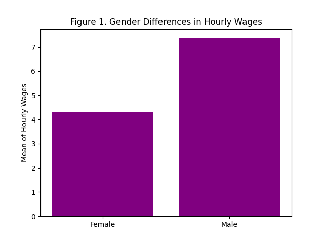

# HW 2: Visualizing interesting datasets
Check out the [project instructions](https://github.com/mikeizbicki/cmc-csci040/tree/2021fall/hw_02)
## Mean Earnings per Hour for Males and Females

This data is from the class ECON125 at CMC. 

## Distribution of Student Loan Forgiveness on Earning Deciles 
I got the data for my plot from this [article](https://www.nber.org/system/files/working_papers/w28175/w28175.pdf).
